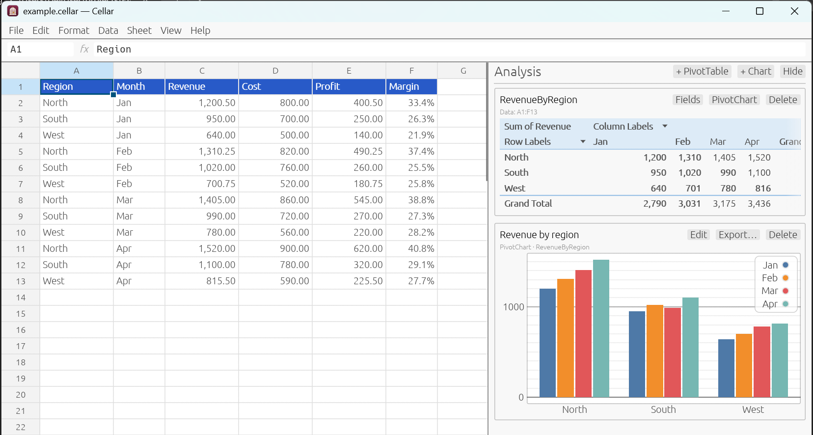

<p align="center">
  
</p>

<h1 align="center">Cellar</h1>

<p align="center">
  <b>A desktop spreadsheet whose workbooks are plain, readable text.</b><br>
  Excel-style formulas, PivotTables and charts, saved in a file you can
  read, diff, merge and keep in git.
</p>

<p align="center">
  macOS · Windows · Linux · MIT licence · built on
  <a href="https://github.com/SamuelSchlesinger/tshts">tshts</a>
</p>

<p align="center">
  <a href="https://buymeacoffee.com/haderlka"></a>
</p>



## Why Cellar?

Spreadsheets end up holding important data, but `.xlsx` files are zipped
XML: you can't see what changed between two versions, and two people
editing the same workbook can't merge their work. Cellar keeps every
workbook in a `.cellar` file:

- **Readable** — one line per cell, in row/column order, with only the
  settings that differ from the defaults.
- **Stable** — saving an unchanged workbook writes a byte-identical file,
  so version control only shows real edits.
- **Mergeable** — edits to different cells touch different lines and merge
  cleanly. PivotTables and charts are stored as short definitions, never
  as computed output, so data edits don't touch them.

```json
"cells": [
  [0, 0, {"format": {"style": {"bold": true}}, "value": "Region"}],
  [1, 2, {"format": {"number_format": {"Number": {"decimals": 2, "thousands_sep": true}}}, "value": "1200.5"}],
  [7, 2, {"formula": "=SUM(C2:C7)", "value": "5821.5"}]
],
```

## Features

**Spreadsheet**
- Grid with mouse selection, column resizing, a formula bar and a name box
  (type `B12` or `A1:C5` to jump/select), sheet tabs, undo/redo, and
  copy/paste that adjusts formulas and works with other apps.
- About 160 Excel-compatible functions, dynamic arrays (`=SORT(A2:A9)`
  spills), `LET`/`LAMBDA`, cross-sheet references, named ranges.
- While typing a formula, click or drag cells to insert references.
- **Fill handle** like Excel's: drag the square at the selection's corner
  to copy formulas (references shift) or continue series (1, 2 → 3, 4 ·
  Jan → Feb · Mon → Tue · Q1 → Q2 · Item1 → Item2). Ctrl (Option on
  macOS) toggles copy/series; double-click fills down alongside the
  neighbouring column; the *Auto Fill* button switches between Copy Cells,
  Fill Series, Fill Formatting Only and Fill Without Formatting.
- Number formats, bold/underline, text and fill colours, sorting.

**PivotTables** (sidebar, Excel-style)
- *PivotTable Fields* pane: field checkboxes, drag & drop between
  Filters / Columns / Rows / Values, and each field's menu (Move Up/Down,
  Move to …, Remove Field, Field Settings).
- Value Field Settings: Sum, Count, Average, Max, Min, Product, Count
  Numbers, StdDev, StdDevp, Var, Varp; all 15 *Show Values As*
  calculations (% of grand/row/column/parent total, difference from,
  running total, rank, index…); number format.
- Field Settings: subtotals, sort A–Z/Z–A/by value, Top 10, item filter.
- Report filters, compact/outline/tabular layout, grand totals, Σ Values
  on rows or columns. Months and weekdays sort in calendar order.
  Results update live as the data changes.

**Charts**
- Column, line, pie and scatter charts in the sidebar, plotting cell ranges.
- **PivotCharts** built from a PivotTable: rows become categories, columns
  × values the series, and the chart follows the pivot's fields and filters.

**Excel**
- *File → Import → Excel workbook…* brings over values, formulas, sheets,
  named ranges, number formats, bold/underline, colours, column widths,
  charts, PivotTables (as live PivotTables) and PivotCharts.
- Every formula is then recalculated by Cellar and compared with the value
  Excel had saved. The import report lists any differences (usually a
  function Cellar doesn't support) so you know which cells to check.
- *File → Export → Excel workbook (.xlsx)* writes values, formulas and
  formatting back out.

**Imports** — *File → Import* (or just *File → Open*):

| Format | Extensions | What comes in |
|---|---|---|
| Excel workbook | `.xlsx` `.xlsm` | values, formulas, formatting, charts, PivotTables |
| Excel binary / 97–2003 | `.xlsb` `.xls` | values and formulas |
| OpenDocument (LibreOffice, Google Sheets download) | `.ods` | values and formulas |
| CSV / delimited text | `.csv` `.txt` | separator detected: `,` `;` tab or `\|` |
| Tab-separated | `.tsv` `.tab` | |
| Markdown tables | `.md` | one sheet per table, named after the heading above it |
| JSON | `.json` | array of records or rows; an object of arrays → one sheet per key |
| JSON Lines | `.jsonl` `.ndjson` | one record per line |

Text files may be UTF-8, UTF-16 (Excel's "Unicode Text") or Windows-1252.
Values from text formats are imported as values, never as formulas.

**Exports**
- Markdown tables of the computed values (current sheet, all sheets, or
  the selection to the clipboard), CSV, and every chart as PNG or SVG.

**Recent files** — *File → Open Recent* lists the last ten workbooks.

## Getting started

Cellar is written in Rust. Install Rust with [rustup](https://rustup.rs),
then:

```bash
git clone <this repository> cellar
cd cellar
cargo run --release
```

The first build takes a few minutes. Afterwards start
`target/release/cellar` (`cellar.exe` on Windows) directly.

Platform notes:
- **macOS** — nothing else is needed.
- **Windows** — the Visual Studio C++ Build Tools are required by Rust's
  MSVC toolchain.
- **Linux** — install the usual GUI development packages, e.g. on
  Debian/Ubuntu `libxkbcommon-dev libgtk-3-dev libssl-dev`.

### Moving from Excel

1. *File → Import → Excel workbook…* and pick the `.xlsx` file.
2. Read the import report: it lists formulas that compute differently and
   PivotTables that were converted.
3. *File → Save As…* to write the `.cellar` file, and commit it to git.

Imported PivotTables live in the sidebar; Excel's static copy of their
output stays in the cells (the report says where) until you delete it.

### Keyboard

Cellar uses Excel's shortcuts, and every menu item shows its shortcut.
*Help → Keyboard Shortcuts & Formulas* lists them all.

| Keys | Action |
|---|---|
| Type, F2, double-click | Edit a cell (typing replaces, F2 keeps the content) |
| Enter / Tab (Shift = back) | Commit and move down / right |
| Ctrl+Enter | Commit into every selected cell |
| Esc | Cancel the edit |
| Arrows, PgUp/PgDn, Home | Move (Shift extends the selection) |
| Ctrl+Arrow, Ctrl+Home, Ctrl+End | Jump to the edge of the data, the first cell, the last used cell |
| Shift+Space / Ctrl+Space / Ctrl+A | Select row / column / all |
| Ctrl+Shift+= / Ctrl+- | Insert / delete (whole rows or columns when selected) |
| Delete | Clear the selected cells |
| Ctrl+C / X / V | Copy / cut / paste |
| Ctrl+Z / Ctrl+Y | Undo / redo |
| Ctrl+D / Ctrl+R | Fill down / fill right |
| Ctrl+B / Ctrl+U | Bold / underline |
| Ctrl+Shift+~ / ! / $ / % | General / number / currency / percent format |
| Ctrl+9 / Ctrl+0 (with Shift: unhide) | Hide rows / columns |
| Ctrl+; / Ctrl+Shift+; | Insert today's date / the current time |
| Alt+= | AutoSum |
| Alt+F1 | Insert chart |
| F9 | Calculate now |
| Shift+F11, Ctrl+PgDn / Ctrl+PgUp | Insert sheet, next / previous sheet |
| Ctrl+S, F12, Ctrl+O, Ctrl+N | Save, Save As, Open, New |
| Ctrl + mouse wheel | Zoom |

On macOS ⌘ replaces Ctrl for the common commands (⌘C, ⌘S, ⌘Arrow…),
Save As is ⌘⇧S, AutoSum ⌘⇧T, and Quit ⌘Q — as in Excel for Mac.

### Batch commands

The same executable converts and exports without opening a window:

```bash
cellar --convert Budget.xlsx                  # writes Budget.cellar, prints the report
cellar --convert data.csv                     # any importable format works
cellar --export-md Budget.cellar              # writes Budget.md (all sheets)
cellar --export-charts Budget.cellar          # PNGs into "Budget charts/"
cellar --export-charts Budget.xlsx out --svg  # SVGs; works on .xlsx too
```

### Uninstalling

`cellar --uninstall` lists what would be removed: the program, the
`cellar` terminal command if you linked one, and everything Cellar stored
for itself (recent files, clipboard cache, on macOS the app's preferences).
Your workbooks are not touched. Quit Cellar, then remove it all with:

```bash
cellar --uninstall --yes
```

On macOS, if `cellar` isn't on your `PATH`, run it from the app bundle:
`/Applications/Cellar.app/Contents/MacOS/cellar --uninstall --yes`.

## Formulas

Formulas use Excel syntax: `=SUM(A1:A10)`, `=IF(B2>0, "yes", "no")`,
`=XLOOKUP("West", A2:A9, C2:C9)`, `=Sheet2!A1`, `=SORT(UNIQUE(A2:A100))`.

| Category | Functions |
|---|---|
| Maths & statistics | ABS, ACOS, ASIN, ATAN, ATAN2, AVERAGE, CEILING, COMBIN, CORREL, COS, COSH, DEGREES, EVEN, EXP, FACT, FLOOR, FREQUENCY, GCD, INT, INTERCEPT, LARGE, LCM, LN, LOG, MAX, MEDIAN, MIN, MOD, MROUND, ODD, PERCENTILE.INC, PI, POWER, RADIANS, RAND, RANDBETWEEN, RANK.EQ, ROUND, ROUNDDOWN, ROUNDUP, RSQ, SIGN, SIN, SINH, SLOPE, SMALL, SQRT, STDEV, STDEV.P, STDEV.S, SUM, SUMPRODUCT, TAN, TANH, TRUNC, VAR.P, VAR.S |
| Logic | AND, FALSE, IF, IFERROR, IFNA, IFS, NOT, OR, SWITCH, TRUE, XOR |
| Lookup & reference | AVERAGEIF, COUNTIF, HLOOKUP, INDEX, INDIRECT, MATCH, OFFSET, SUMIF, VLOOKUP, XLOOKUP |
| Text | ARRAYTOTEXT, CHAR, CLEAN, CODE, CONCAT, DOLLAR, EXACT, FIND, FIXED, LEFT, LEN, LOWER, MID, NUMBERVALUE, PROPER, REGEXEXTRACT, REGEXMATCH, REGEXREPLACE, REPLACE, REPT, RIGHT, SEARCH, SUBSTITUTE, TEXT, TEXTAFTER, TEXTBEFORE, TEXTJOIN, TRIM, UNICHAR, UNICODE, UPPER, VALUE |
| Date & time | DATE, DATEDIF, DATEVALUE, DAY, DAYS, EDATE, EOMONTH, HOUR, MINUTE, MONTH, NETWORKDAYS, NOW, SECOND, TIME, TIMEVALUE, TODAY, WEEKDAY, WORKDAY, YEAR, YEARFRAC |
| Finance | FV, NPV, PMT, PV |
| Information | COUNT, COUNTA, ERROR.TYPE, ISBLANK, ISERR, ISERROR, ISNA, ISNUMBER, ISTEXT, NA, TYPE |
| Dynamic arrays & lambdas | BYCOL, BYROW, FILTER, LAMBDA, LET, MAKEARRAY, MAP, REDUCE, SCAN, SEQUENCE, SORT, TRANSPOSE, UNIQUE |
| Other | GET (fetch a URL), SPARKLINE |

Excel error values (`#REF!`, `#N/A`, `#DIV/0!`, `#VALUE!`, `#NAME?`,
`#NUM!`, `#NULL!`, `#SPILL!`) behave as in Excel, and formulas that would
create a circular reference are rejected.

## The `.cellar` format

A `.cellar` file is JSON written in a canonical layout: keys sorted, cells
sorted by position, one line per cell, default fields omitted. A workbook
holds its sheets; each sheet has its `cells`, column widths, and — when
present — `pivots` and `charts`:

```json
"pivots": [
  {
    "columns": [{"field": "Month"}],
    "name": "PivotTable1",
    "rows": [{"field": "Region", "sort": {"by_value": {"descending": true, "value": 0}}}],
    "source": "A1:F7",
    "values": [{"field": "Revenue"}]
  }
],
"charts": [
  {"pivot": "PivotTable1", "title": "Revenue by region", "type": "bar"}
],
```

Formula cells also store their last computed value, so a file is readable
without Cellar. tshts files use the same format: rename a `.tshts` file to
`.cellar` to open it.

## Development

```bash
cargo test                        # unit tests + end-to-end scenario tests
cargo clippy --all-targets        # lints (kept warning-free)
cargo bench --bench calc_engine   # recalculation benchmarks
cargo run --example render_icons  # regenerate assets/icon-*.png and icon.ico from assets/logo.svg
```

Releases are built by GitHub Actions; see [docs/release.md](docs/release.md).

The code follows tshts' layered design:

| Layer | Path | Contents |
|---|---|---|
| Domain | `src/domain/` | Cells, sheets, workbooks; formula parser and evaluator; dependency graph and parallel recalculation; PivotTable engine; Markdown export |
| Application | `src/application/` | The editing session (`App`): undo/redo, clipboard, fill, formatting, pivots, charts, sheet commands |
| Infrastructure | `src/infrastructure/` | `.cellar` files, Excel import/export, CSV, chart images, recent files, HTTP for `GET()` |
| GUI | `src/gui/` | The egui app: window and menus, grid, sidebar, PivotTable UI, charts, dialogs |

The scenario tests in `tests/` type complete financial models (DCF,
amortization, tax brackets, FIFO inventory…) into a workbook and compare
every result with an independent Rust implementation.

## Support

Cellar is free and open source. If it saves you time, you can support its
development on [Buy Me a Coffee](https://buymeacoffee.com/haderlka).

## Credits

**Cellar is built on [tshts](https://github.com/SamuelSchlesinger/tshts)**
by Samuel Schlesinger, a terminal spreadsheet with an Excel-equivalent
formula language. Cellar replaces tshts' terminal interface with a desktop
GUI and adds PivotTables, charts, the readable file layout and a richer
Excel converter, but its core is tshts' work. From tshts, Cellar uses:

- the formula language: lexer, parser and evaluator, the ~160 built-in
  functions, dynamic arrays, `LET`/`LAMBDA`, Excel error values;
- the calculation engine: the workbook-wide dependency graph, parallel
  recalculation, volatile functions, iterative calculation;
- the workbook model: sheets, cells, formats, named ranges, tables,
  conditional formats, and the JSON file format (Cellar's files are tshts
  files with a canonical layout);
- the editing session: undo/redo, copy/paste with formula adjustment,
  insert/delete rows and columns, sorting, filtering, series detection;
- Excel import (via calamine) and the hand-written `.xlsx` exporter, CSV
  import/export, and the `GET()` web function;
- the end-to-end financial-model scenario tests.

Cellar also relies on these open-source libraries: egui/eframe and
egui_plot (GUI and charts), rfd (file dialogs), calamine and quick-xml
(Excel files), plotters and resvg (chart and icon rendering), serde, rayon,
reqwest, arboard, regex, csv and zip.

## Licence

MIT — see [LICENSE](LICENSE). tshts is © 2025 Samuel Schlesinger, also
under the MIT licence; its notice is kept in the LICENSE file.
